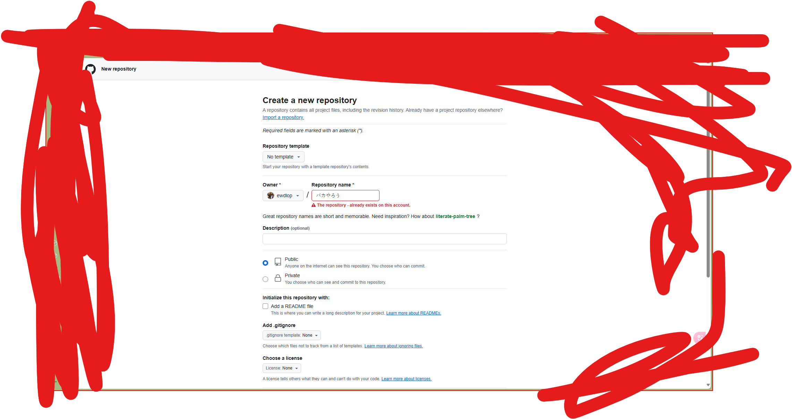

# MangaTheories
Mango; NeuralNetwork to predict manga, tv shows, crazy ex, or your partner's next MOVE;

#

(00:10) مرحبا مرحبا عفوا هل هناك اي مطعم جيد هنا مطعم جيد إنجليزية؟ أوه - من هذا الشارع اذهب من فضلك هامبورغ , شريحة لحم  , أومورايس صلصة الثوم و عصارة لذيذة الطعم مقهى القهوة وجلي القهوة و عصير الجريب فروت الفلفل الأخضر والطماطم والجبن ساندويتش لذيذ جدا بهذا الاتجاه هنالك مخبز خبز كروكيت خبز الأناناس الخبز المحمص جيده مثل النعيم دعنا نذهب ماذا ؟ ما - كدو - نالدز - (ماكدونالدز) صباح الخير طوكيو ، يوم طيب آسف ، انا اجنبي انا لا اتكلم اليابانيه ولكن احب اوي سورا (ممثلة) عندما تقولي " فهمت "
(01:22) آقول هيتاتشي تويوتا كاواسكي نينتندو كانون سوني وهوندا آنا آفقد طريقي ايها جدة ، من اين يجب ان اذهب ؟ شينجوكو كبيره جدآ آنا بحاجه الى عبقور (شخصية كرتونية) انت تتكلم يابانية انجليزي (يابانجليزي) وآرني لغة الجسد ماذا عليا ان افعل اين يجب ان اذهب لا لا لا لا ماكدونالدز جوجل ، حمام كيت كات ديزني لاند تاكسي يذهب إلى فندق سبعه ، احدى عشر، حليب باص بيرة ستاربكس صباح الخير طوكيو ، يوم طيب آسف ، انا اجنبي آنا لا آتكلم اليابانيه ولكن آحب رامن تيمبورا (اكلة يابانية) عندما تقولي شكرا  مساء الخير آقول سازوكي ياماها
(02:22) يونيكلو توشيبا كاسيو جودزيلا آنا آفقد طريقي ايها الجده ، اين عليا ان اذهب ؟ شينجوكو كبيره جدآ آحتاج الى عبقور (شخصية كرتونية) انت تتكلم يابانجليزي آرني لغة الجسد ماذا عليا ان افعل اين يجب ان اذهب آرجوك خدني الى المنزل لا لا لا لا ماكدونالدز جوجل حمام كيت كات ديزني لاند تاكسي يذهب إلى فندق سبعة ، آحدى عشر ، حليب باص بيرة ستاربكس سلطه ، هامبرجر ساندوتش ، نقانق قهوة ، كيك مثلاجات ,  محل بقاله بطاطه مقليه سلم كهربائي , الكحول الكرة الطائرة ، البيسبول كرة سله ، جولف ماكدونالدز جوجل ، حمام كيت كات ديزني لاند
(03:32) تاكسي يذهب إلى فندق سبعة ، آحدى عشر ، حليب باص بيرة ستاربكس باكيرو " انت غابي" باكيارو " أنت  غبي " باكيرو " انت غابي " با كا يا رو او "أ نـ ـت غـ ـبـ ـي" باكيرو " ايها الغبي " وفي النهاية  " تحيه للاوتاكو العرب وعشاق اليابان " الى لقاء

#

The programming language **F#** is part of the .NET ecosystem. It is a **functional-first programming language** that is integrated into the .NET runtime and libraries. Here's a breakdown:

1. **F# as a Language**: 
   - F# is specifically designed to support functional programming but also supports object-oriented and imperative programming paradigms.
   - It is fully supported by Microsoft and the .NET Foundation.

2. **.NET Ecosystem**:
   - F# runs on the .NET runtime (CoreCLR for .NET Core/modern .NET and Mono for cross-platform).
   - It can use any library available in the .NET ecosystem, including those written in C# or VB.NET.

3. **Usage with .NET**:
   - F# code is compiled to intermediate language (IL), just like other .NET languages.
   - F# projects are typically managed using `.fsproj` files, similar to `.csproj` files for C#.

4. **Tooling and Integration**:
   - F# is supported in IDEs like Visual Studio and JetBrains Rider, as well as lightweight editors like Visual Studio Code.
   - It works with .NET SDK tools (`dotnet` CLI) for building, running, and managing F# applications.

So, **F#** is not a separate entity from .NET—it is a language within the .NET framework. **F\***, on the other hand, is not a recognized language or framework term within the .NET space.
